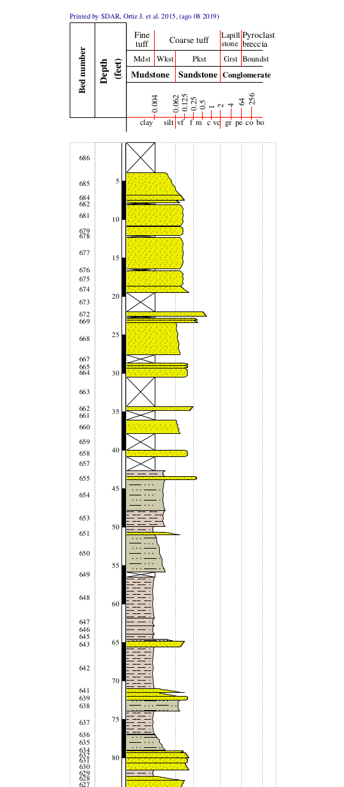
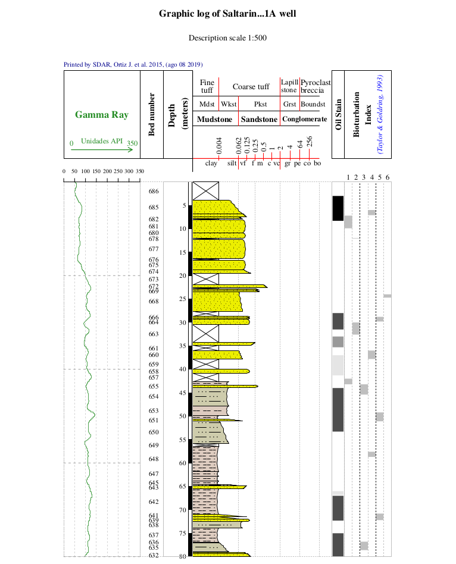
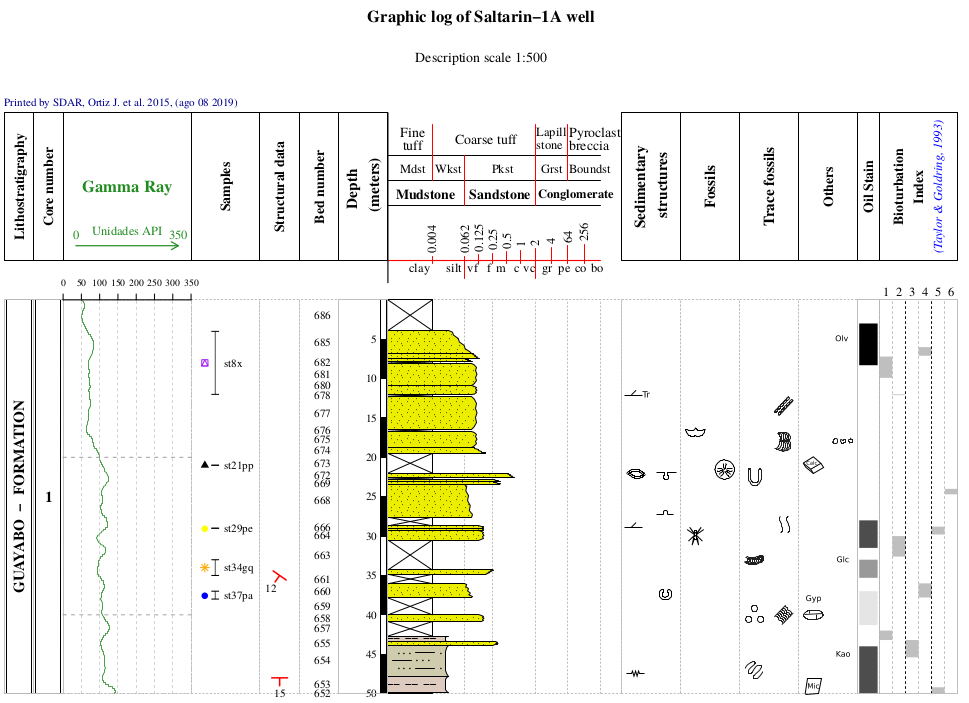

```{r, echo = FALSE, message = FALSE}
knitr::opts_chunk$set(collapse = T, comment = "#>")
options(tibble.print_min = 4L, tibble.print_max = 4L)
library(SDAR)
```

## Stratigraphic Data Analysis (SDAR)

<center>
#### **John Ortiz <sup>1,2</sup>, Carlos Jaramillo <sup>2</sup>**
</center>

<sup>1</sup> Smithsonian Tropical Research Institute,Balboa, Ancon, Republic of Panama,
<sup>2</sup> Corporación Geológica ARES, Bogotá, Colombia.


>**SDAR** is a fast and consistent tool for plotting and facilitating the analysis of stratigraphic
and sedimentological data, designed to plot detailed stratigraphic sections and to perform quantitative stratigraphic analyses.

### Abstract

Stratigraphic Columns (SC) are the most useful and common ways to represent the field
descriptions (e.g., grain size, the thickness of rock packages, fossil
content and lithological components) of rock sequences and well logs. 
In these representations, the width of SC vary according to the grain size 
(i.e., the wider the strata, the coarser the rocks (<span style="color:blue">Miall 1990</span>; 
<span style="color:blue">Tucker 2011</span>)),
and the thickness of each layer is represented at the vertical axis of the 
diagram. Typically these representations are drawn 'manually' using vector 
graphic editors (e.g., Adobe Illustrator<sup>**&#174;**</sup>, CorelDRAW<sup>**&#174;**</sup>, Inskape).
Nowadays there are various software packages which automatically plots SCs, but there
are not versatile open-source tools and it is very difficult to both store
and analyse stratigraphic information.

This document presents Stratigraphic Data Analysis in R (**SDAR**), an analytical
package designed for both plotting and facilitate the analysis of Stratigraphic
Data in R (<span style="color:blue">R Core Team 2019</span>). **SDAR**, uses simple stratigraphic data and takes advantage
of the flexible plotting tools available in R to produce detailed SCs. 
The main benefits of **SDAR** are: 

*  used to generate accurate and complete SC plot including multiple features
   (e.g., sedimentary structures, samples, fossil content, color, structural data,
   contacts between beds)
*  developed in a free software environment for statistical computing and graphics
*  run on a wide variety of platforms (i.e., UNIX, Windows, and MacOS)
*  both plotting and analysing functions can be executed directly on R's 
   command-line interface (CLI), consequently this feature enables users
   to integrate SDAR's functions with several other add-on packages available
   for R from [The Comprehensive R Archive Network](https://cran.r-project.org) (CRAN).
**Keywords: Quantitative Stratigraphy, Stratigraphic log, R package, Geosciences software**

#### Acknowledgments

>This project has been sponsored by Carlos Jaramillo (Smithsonian Tropical Research Institute (STRI)), 
COLCIENCIAS con Fondos para la Investigación de la Ciencia y la Tecnológia del Banco de la República, 
and Corporación Geológica ARES. 

### Data model

This chapter presents a summary of the specific types of data required by **SDAR** package. The
representation schemes and standard formats that should be satisfied by the input data set to 
be integrated on **SDAR** are mentioned.

Many of the sedimentological, stratigraphical and paleontological features share common properties. For example,
**beds**, **intervals** and lithostratigraphic and chronostratigraphic units are all defined over a stratigraphic range 
(i.e., each of them has to be defined by a **base** and a **top**). Moreover, features as samples, structural data, and geochemical and geochronological analysis, are usually collected, or correspond to a specific stratigraphic position
(i.e., each of them represents a unique depth into the SC). On the other hand, other features as fossil occurrences, bioturbation, and sedimentary structures, could be described by both, stratigraphic range, or a specific stratigraphic
position (e.g., a fossil occurrence could be presented in a specific depth, throughout a bed, or throughout a set of beds). Therefore, a flexible data model able to store and to integrate all the previous descriptions was implemented.
**SDAR** allows users to provide stratigraphic information in these three main types: **beds**, **intervals**
and **punctual features**. A description and an example of each data type are provided below.

### Data format to integrate rock layers (**beds**)

A layer of rock is the fundamental unit in an SC representation. It describes the thickness, composition, and texture of a rock. In order to integrate a stratigraphic layer in **SDAR**, the information required for each layer is bed number, thickness (i.e, it is defined by a base and a top), rock type, primary lithology, and grain size. To improve communication between geoscientists, some conventions, defined by sedimentologists to draw lithology patterns, and to describe grain size and color, are implemented. Details on the information required to define a layer and the sources for the conventions implemented are provided below.

*  **bed_number**: numeric. It is often useful to give to each bed, or rock unit, a number so as to facilitate later 
   reference; begins at the stratigraphically lowest bed (<span style="color:blue">tucker2011</span>).
*  **base** and **top**: numeric. They define the bed thickness of each layer. Overlapping is not allowed between layers.
*  **rock_type**: string or numeric. This field must include only one of the values listed in **Table 1**.

<center>
###### Table 1: Rock type.
<table style="border-collapse:collapse; border:none;">
<tr>
<th style="border-top: double; text-align:center; font-style:italic; font-weight:bold; padding:0.2cm; border-bottom:1px solid black; text-align:left; ">id</th>
<th style="border-top: double; text-align:center; font-style:italic; font-weight:bold; padding:0.2cm; border-bottom:1px solid black; ">name</th>
</tr>
<tr>
<td style=" padding:0.2cm; text-align:left; vertical-align:top; text-align:left; ">1</td>
<td style=" padding:0.2cm; text-align:left; vertical-align:top; text-align:left; ">sedimentary</td>
</tr>
<tr>
<td style=" padding:0.2cm; text-align:left; vertical-align:top; text-align:left; background-color:#f2f2f2; ">2</td>
<td style=" padding:0.2cm; text-align:left; vertical-align:top; text-align:left; background-color:#f2f2f2; ">igneous</td>
</tr>
<tr>
<td style=" padding:0.2cm; text-align:left; vertical-align:top; text-align:left; ">3</td>
<td style=" padding:0.2cm; text-align:left; vertical-align:top; text-align:left; ">covered</td>
</tr>
</table>
</center>

*  **prim_litho**: string or numeric. This field must include only the values listed in **Table 2**. (To draw lithologic patterns, conventions suggested by the Federal Geographic Data Committee FGDC (<span style="color:blue">fgdc2006</span>) are implemented).

<center>
###### Table 2: Primary lithology.
<table style="border-collapse:collapse; border:none;">
<tr>
<th style="border-top: double; text-align:center; font-style:italic; font-weight:bold; padding:0.2cm; border-bottom:1px solid black; text-align:left; ">id</th>
<th style="border-top: double; text-align:center; font-style:italic; font-weight:bold; padding:0.2cm; border-bottom:1px solid black; ">name</th>
<th style="border-top: double; text-align:center; font-style:italic; font-weight:bold; padding:0.2cm; border-bottom:1px solid black; ">id.</th>
<th style="border-top: double; text-align:center; font-style:italic; font-weight:bold; padding:0.2cm; border-bottom:1px solid black; ">name.</th>
</tr>
<tr>
<td style=" padding:0.2cm; text-align:left; vertical-align:top; text-align:center; ">1</td>
<td style=" padding:0.2cm; text-align:left; vertical-align:top; text-align:left; ">claystone</td>
<td style=" padding:0.2cm; text-align:left; vertical-align:top; text-align:center; ">7</td>
<td style=" padding:0.2cm; text-align:left; vertical-align:top; text-align:left; ">breccia</td>
</tr>
<tr>
<td style=" padding:0.2cm; text-align:left; vertical-align:top; text-align:center; background-color:#f2f2f2; ">2</td>
<td style=" padding:0.2cm; text-align:left; vertical-align:top; text-align:left; background-color:#f2f2f2; ">siltstone</td>
<td style=" padding:0.2cm; text-align:left; vertical-align:top; text-align:center; background-color:#f2f2f2; ">8</td>
<td style=" padding:0.2cm; text-align:left; vertical-align:top; text-align:left; background-color:#f2f2f2; ">limestone</td>
</tr>
<tr>
<td style=" padding:0.2cm; text-align:left; vertical-align:top; text-align:center; ">3</td>
<td style=" padding:0.2cm; text-align:left; vertical-align:top; text-align:left; ">mudstone</td>
<td style=" padding:0.2cm; text-align:left; vertical-align:top; text-align:center; ">9</td>
<td style=" padding:0.2cm; text-align:left; vertical-align:top; text-align:left; ">dolomite</td>
</tr>
<tr>
<td style=" padding:0.2cm; text-align:left; vertical-align:top; text-align:center; background-color:#f2f2f2; ">4</td>
<td style=" padding:0.2cm; text-align:left; vertical-align:top; text-align:left; background-color:#f2f2f2; ">shale</td>
<td style=" padding:0.2cm; text-align:left; vertical-align:top; text-align:center; background-color:#f2f2f2; ">13</td>
<td style=" padding:0.2cm; text-align:left; vertical-align:top; text-align:left; background-color:#f2f2f2; ">coal</td>
</tr>
<tr>
<td style=" padding:0.2cm; text-align:left; vertical-align:top; text-align:center; ">5</td>
<td style=" padding:0.2cm; text-align:left; vertical-align:top; text-align:left; ">sandstone</td>
<td style=" padding:0.2cm; text-align:left; vertical-align:top; text-align:center; ">24</td>
<td style=" padding:0.2cm; text-align:left; vertical-align:top; text-align:left; ">tuff</td>
</tr>
<tr>
<td style=" padding:0.2cm; text-align:left; vertical-align:top; text-align:center; border-bottom: double; background-color:#f2f2f2; ">6</td>
<td style=" padding:0.2cm; text-align:left; vertical-align:top; text-align:left; border-bottom: double; background-color:#f2f2f2; ">conglomerate</td>
<td style=" padding:0.2cm; text-align:left; vertical-align:top; text-align:center; border-bottom: double; background-color:#f2f2f2; ">26</td>
<td style=" padding:0.2cm; text-align:left; vertical-align:top; text-align:left; border-bottom: double; background-color:#f2f2f2; ">granite</td>
</tr>
</table>
</center>

*  **grain_size**: string or numeric. This field must include only the values listed in Table 3.
   Grain size is a fundamental attribute of siliciclastic sedimentary and pyroclastic rocks, and thus one of the most important descriptive properties of such rocks. Grain size is represented by the width of the SC (<span style="color:blue">miall 1990</span>), and it is indicated by the graphic scale at the header of the SC (see, **Figure 1**). The conventions clay, mud, silt; vf, f, m, c and vc very fine, fine, medium, coarse, and very coarse sand; gr granule; pe pebble; co cobble; bo boulder are based on the Wentworth classification system for siliciclastic rocks (<span style="color:blue">wentworth 1922</span>), for pyroclastic rocks (<span style="color:blue">wentworth 1932</span>), and for classification of carbonate rocks (<span style="color:blue">dunham 1962</span>) are implemented.

<center>
###### Table 3: Grain size table.
<table style="border-collapse:collapse; border:none;">
<tr>
<th style="border-top: double; text-align:center; font-style:italic; font-weight:bold; padding:0.2cm; border-bottom:1px solid black; text-align:left; ">id</th>
<th style="border-top: double; text-align:center; font-style:italic; font-weight:bold; padding:0.2cm; border-bottom:1px solid black; ">name</th>
<th style="border-top: double; text-align:center; font-style:italic; font-weight:bold; padding:0.2cm; border-bottom:1px solid black; ">id.</th>
<th style="border-top: double; text-align:center; font-style:italic; font-weight:bold; padding:0.2cm; border-bottom:1px solid black; ">name.</th>
</tr>
<tr>
<td style=" padding:0.2cm; text-align:left; vertical-align:top; text-align:left; ">1</td>
<td style=" padding:0.2cm; text-align:left; vertical-align:top; text-align:left; ">clay</td>
<td style=" padding:0.2cm; text-align:left; vertical-align:top; text-align:left; ">21</td>
<td style=" padding:0.2cm; text-align:left; vertical-align:top; text-align:left; ">boulder</td>
</tr>
<tr>
<td style=" padding:0.2cm; text-align:left; vertical-align:top; text-align:left; background-color:#f2f2f2; ">2</td>
<td style=" padding:0.2cm; text-align:left; vertical-align:top; text-align:left; background-color:#f2f2f2; ">clay / silt</td>
<td style=" padding:0.2cm; text-align:left; vertical-align:top; text-align:left; background-color:#f2f2f2; ">22</td>
<td style=" padding:0.2cm; text-align:left; vertical-align:top; text-align:left; background-color:#f2f2f2; ">mudstone</td>
</tr>
<tr>
<td style=" padding:0.2cm; text-align:left; vertical-align:top; text-align:left; ">3</td>
<td style=" padding:0.2cm; text-align:left; vertical-align:top; text-align:left; ">silt</td>
<td style=" padding:0.2cm; text-align:left; vertical-align:top; text-align:left; ">23</td>
<td style=" padding:0.2cm; text-align:left; vertical-align:top; text-align:left; ">wackestone</td>
</tr>
<tr>
<td style=" padding:0.2cm; text-align:left; vertical-align:top; text-align:left; background-color:#f2f2f2; ">4</td>
<td style=" padding:0.2cm; text-align:left; vertical-align:top; text-align:left; background-color:#f2f2f2; ">silt / very fine sand</td>
<td style=" padding:0.2cm; text-align:left; vertical-align:top; text-align:left; background-color:#f2f2f2; ">24</td>
<td style=" padding:0.2cm; text-align:left; vertical-align:top; text-align:left; background-color:#f2f2f2; ">packstone</td>
</tr>
<tr>
<td style=" padding:0.2cm; text-align:left; vertical-align:top; text-align:left; ">5</td>
<td style=" padding:0.2cm; text-align:left; vertical-align:top; text-align:left; ">very fine sand</td>
<td style=" padding:0.2cm; text-align:left; vertical-align:top; text-align:left; ">25</td>
<td style=" padding:0.2cm; text-align:left; vertical-align:top; text-align:left; ">grainstone</td>
</tr>
<tr>
<td style=" padding:0.2cm; text-align:left; vertical-align:top; text-align:left; background-color:#f2f2f2; ">6</td>
<td style=" padding:0.2cm; text-align:left; vertical-align:top; text-align:left; background-color:#f2f2f2; ">very fine / fine sand</td>
<td style=" padding:0.2cm; text-align:left; vertical-align:top; text-align:left; background-color:#f2f2f2; ">26</td>
<td style=" padding:0.2cm; text-align:left; vertical-align:top; text-align:left; background-color:#f2f2f2; ">boundstone</td>
</tr>
<tr>
<td style=" padding:0.2cm; text-align:left; vertical-align:top; text-align:left; ">7</td>
<td style=" padding:0.2cm; text-align:left; vertical-align:top; text-align:left; ">fine sand</td>
<td style=" padding:0.2cm; text-align:left; vertical-align:top; text-align:left; ">27</td>
<td style=" padding:0.2cm; text-align:left; vertical-align:top; text-align:left; ">floatstone</td>
</tr>
<tr>
<td style=" padding:0.2cm; text-align:left; vertical-align:top; text-align:left; background-color:#f2f2f2; ">8</td>
<td style=" padding:0.2cm; text-align:left; vertical-align:top; text-align:left; background-color:#f2f2f2; ">fine / medium sand</td>
<td style=" padding:0.2cm; text-align:left; vertical-align:top; text-align:left; background-color:#f2f2f2; ">28</td>
<td style=" padding:0.2cm; text-align:left; vertical-align:top; text-align:left; background-color:#f2f2f2; ">rudstone</td>
</tr>
<tr>
<td style=" padding:0.2cm; text-align:left; vertical-align:top; text-align:left; ">9</td>
<td style=" padding:0.2cm; text-align:left; vertical-align:top; text-align:left; ">medium sand</td>
<td style=" padding:0.2cm; text-align:left; vertical-align:top; text-align:left; ">29</td>
<td style=" padding:0.2cm; text-align:left; vertical-align:top; text-align:left; ">bafflestone</td>
</tr>
<tr>
<td style=" padding:0.2cm; text-align:left; vertical-align:top; text-align:left; background-color:#f2f2f2; ">10</td>
<td style=" padding:0.2cm; text-align:left; vertical-align:top; text-align:left; background-color:#f2f2f2; ">medium / coarse sand</td>
<td style=" padding:0.2cm; text-align:left; vertical-align:top; text-align:left; background-color:#f2f2f2; ">30</td>
<td style=" padding:0.2cm; text-align:left; vertical-align:top; text-align:left; background-color:#f2f2f2; ">bindstone</td>
</tr>
<tr>
<td style=" padding:0.2cm; text-align:left; vertical-align:top; text-align:left; ">11</td>
<td style=" padding:0.2cm; text-align:left; vertical-align:top; text-align:left; ">coarse sand</td>
<td style=" padding:0.2cm; text-align:left; vertical-align:top; text-align:left; ">31</td>
<td style=" padding:0.2cm; text-align:left; vertical-align:top; text-align:left; ">framestone</td>
</tr>
<tr>
<td style=" padding:0.2cm; text-align:left; vertical-align:top; text-align:left; background-color:#f2f2f2; ">12</td>
<td style=" padding:0.2cm; text-align:left; vertical-align:top; text-align:left; background-color:#f2f2f2; ">coarse / very coarse sand</td>
<td style=" padding:0.2cm; text-align:left; vertical-align:top; text-align:left; background-color:#f2f2f2; ">32</td>
<td style=" padding:0.2cm; text-align:left; vertical-align:top; text-align:left; background-color:#f2f2f2; ">crystalline</td>
</tr>
<tr>
<td style=" padding:0.2cm; text-align:left; vertical-align:top; text-align:left; ">13</td>
<td style=" padding:0.2cm; text-align:left; vertical-align:top; text-align:left; ">very coarse sand</td>
<td style=" padding:0.2cm; text-align:left; vertical-align:top; text-align:left; ">33</td>
<td style=" padding:0.2cm; text-align:left; vertical-align:top; text-align:left; ">fine ash</td>
</tr>
<tr>
<td style=" padding:0.2cm; text-align:left; vertical-align:top; text-align:left; background-color:#f2f2f2; ">14</td>
<td style=" padding:0.2cm; text-align:left; vertical-align:top; text-align:left; background-color:#f2f2f2; ">very coarse / granule</td>
<td style=" padding:0.2cm; text-align:left; vertical-align:top; text-align:left; background-color:#f2f2f2; ">34</td>
<td style=" padding:0.2cm; text-align:left; vertical-align:top; text-align:left; background-color:#f2f2f2; ">medium ash</td>
</tr>
<tr>
<td style=" padding:0.2cm; text-align:left; vertical-align:top; text-align:left; ">15</td>
<td style=" padding:0.2cm; text-align:left; vertical-align:top; text-align:left; ">granule</td>
<td style=" padding:0.2cm; text-align:left; vertical-align:top; text-align:left; ">35</td>
<td style=" padding:0.2cm; text-align:left; vertical-align:top; text-align:left; ">coarse ash</td>
</tr>
<tr>
<td style=" padding:0.2cm; text-align:left; vertical-align:top; text-align:left; background-color:#f2f2f2; ">16</td>
<td style=" padding:0.2cm; text-align:left; vertical-align:top; text-align:left; background-color:#f2f2f2; ">granule / pebble</td>
<td style=" padding:0.2cm; text-align:left; vertical-align:top; text-align:left; background-color:#f2f2f2; ">36</td>
<td style=" padding:0.2cm; text-align:left; vertical-align:top; text-align:left; background-color:#f2f2f2; ">fine lapilli</td>
</tr>
<tr>
<td style=" padding:0.2cm; text-align:left; vertical-align:top; text-align:left; ">17</td>
<td style=" padding:0.2cm; text-align:left; vertical-align:top; text-align:left; ">pebble</td>
<td style=" padding:0.2cm; text-align:left; vertical-align:top; text-align:left; ">37</td>
<td style=" padding:0.2cm; text-align:left; vertical-align:top; text-align:left; ">medium lapilli</td>
</tr>
<tr>
<td style=" padding:0.2cm; text-align:left; vertical-align:top; text-align:left; background-color:#f2f2f2; ">18</td>
<td style=" padding:0.2cm; text-align:left; vertical-align:top; text-align:left; background-color:#f2f2f2; ">pebble / cobble</td>
<td style=" padding:0.2cm; text-align:left; vertical-align:top; text-align:left; background-color:#f2f2f2; ">38</td>
<td style=" padding:0.2cm; text-align:left; vertical-align:top; text-align:left; background-color:#f2f2f2; ">coarse lapilli</td>
</tr>
<tr>
<td style=" padding:0.2cm; text-align:left; vertical-align:top; text-align:left; ">19</td>
<td style=" padding:0.2cm; text-align:left; vertical-align:top; text-align:left; ">cobble</td>
<td style=" padding:0.2cm; text-align:left; vertical-align:top; text-align:left; ">39</td>
<td style=" padding:0.2cm; text-align:left; vertical-align:top; text-align:left; ">fine block</td>
</tr>
<tr>
<td style=" padding:0.2cm; text-align:left; vertical-align:top; text-align:left; border-bottom: double; background-color:#f2f2f2; ">20</td>
<td style=" padding:0.2cm; text-align:left; vertical-align:top; text-align:left; border-bottom: double; background-color:#f2f2f2; ">cobble / boulder</td>
<td style=" padding:0.2cm; text-align:left; vertical-align:top; text-align:left; border-bottom: double; background-color:#f2f2f2; ">40</td>
<td style=" padding:0.2cm; text-align:left; vertical-align:top; text-align:left; border-bottom: double; background-color:#f2f2f2; ">coarse block</td>
</tr>
</table>
</center>

In summary, a table with the structure presented in **table 4** must be
provided. Each row in this data array describes a stratigraphic bed/layer.

<center>
##### Table 4: Example of beds/layers table.
<table style="border-collapse:collapse; border:none;">
<tr>
<th style="border-top: double; text-align:center; font-style:italic; font-weight:bold; padding:0.2cm; border-bottom:1px solid black; text-align:left; ">bed_number</th>
<th style="border-top: double; text-align:center; font-style:italic; font-weight:bold; padding:0.2cm; border-bottom:1px solid black; ">base</th>
<th style="border-top: double; text-align:center; font-style:italic; font-weight:bold; padding:0.2cm; border-bottom:1px solid black; ">top</th>
<th style="border-top: double; text-align:center; font-style:italic; font-weight:bold; padding:0.2cm; border-bottom:1px solid black; ">rock_type</th>
<th style="border-top: double; text-align:center; font-style:italic; font-weight:bold; padding:0.2cm; border-bottom:1px solid black; ">prim_litho</th>
<th style="border-top: double; text-align:center; font-style:italic; font-weight:bold; padding:0.2cm; border-bottom:1px solid black; ">grain_size</th>
</tr>
<tr>
<td style=" padding:0.2cm; text-align:left; vertical-align:top; text-align:center; ">1</td>
<td style=" padding:0.2cm; text-align:left; vertical-align:top; text-align:center; ">671</td>
<td style=" padding:0.2cm; text-align:left; vertical-align:top; text-align:center; ">670.2</td>
<td style=" padding:0.2cm; text-align:left; vertical-align:top; text-align:center; ">sedimentary</td>
<td style=" padding:0.2cm; text-align:left; vertical-align:top; text-align:left; ">claystone</td>
<td style=" padding:0.2cm; text-align:left; vertical-align:top; text-align:left; ">clay</td>
</tr>
<tr>
<td style=" padding:0.2cm; text-align:left; vertical-align:top; text-align:center; background-color:#f2f2f2; ">2</td>
<td style=" padding:0.2cm; text-align:left; vertical-align:top; text-align:center; background-color:#f2f2f2; ">670.2</td>
<td style=" padding:0.2cm; text-align:left; vertical-align:top; text-align:center; background-color:#f2f2f2; ">669.4</td>
<td style=" padding:0.2cm; text-align:left; vertical-align:top; text-align:center; background-color:#f2f2f2; ">sedimentary</td>
<td style=" padding:0.2cm; text-align:left; vertical-align:top; text-align:left; background-color:#f2f2f2; ">siltstone</td>
<td style=" padding:0.2cm; text-align:left; vertical-align:top; text-align:left; background-color:#f2f2f2; ">silt</td>
</tr>
<tr>
<td style=" padding:0.2cm; text-align:left; vertical-align:top; text-align:center; ">3</td>
<td style=" padding:0.2cm; text-align:left; vertical-align:top; text-align:center; ">669.4</td>
<td style=" padding:0.2cm; text-align:left; vertical-align:top; text-align:center; ">669.18</td>
<td style=" padding:0.2cm; text-align:left; vertical-align:top; text-align:center; ">sedimentary</td>
<td style=" padding:0.2cm; text-align:left; vertical-align:top; text-align:left; ">sandstone</td>
<td style=" padding:0.2cm; text-align:left; vertical-align:top; text-align:left; ">medium sand</td>
</tr>
<tr>
<td style=" padding:0.2cm; text-align:left; vertical-align:top; text-align:center; background-color:#f2f2f2; ">4</td>
<td style=" padding:0.2cm; text-align:left; vertical-align:top; text-align:center; background-color:#f2f2f2; ">669.18</td>
<td style=" padding:0.2cm; text-align:left; vertical-align:top; text-align:center; background-color:#f2f2f2; ">667.6</td>
<td style=" padding:0.2cm; text-align:left; vertical-align:top; text-align:center; background-color:#f2f2f2; ">sedimentary</td>
<td style=" padding:0.2cm; text-align:left; vertical-align:top; text-align:left; background-color:#f2f2f2; ">limestone</td>
<td style=" padding:0.2cm; text-align:left; vertical-align:top; text-align:left; background-color:#f2f2f2; ">wackestone</td>
</tr>
<tr>
<td style=" padding:0.2cm; text-align:left; vertical-align:top; text-align:center; ">5</td>
<td style=" padding:0.2cm; text-align:left; vertical-align:top; text-align:center; ">667.6</td>
<td style=" padding:0.2cm; text-align:left; vertical-align:top; text-align:center; ">667.2</td>
<td style=" padding:0.2cm; text-align:left; vertical-align:top; text-align:center; ">sedimentary</td>
<td style=" padding:0.2cm; text-align:left; vertical-align:top; text-align:left; ">conglomerate</td>
<td style=" padding:0.2cm; text-align:left; vertical-align:top; text-align:left; ">boulder</td>
</tr>
<tr>
<td style=" padding:0.2cm; text-align:left; vertical-align:top; text-align:center; border-bottom: double; background-color:#f2f2f2; ">6</td>
<td style=" padding:0.2cm; text-align:left; vertical-align:top; text-align:center; border-bottom: double; background-color:#f2f2f2; ">667.2</td>
<td style=" padding:0.2cm; text-align:left; vertical-align:top; text-align:center; border-bottom: double; background-color:#f2f2f2; ">666.2</td>
<td style=" padding:0.2cm; text-align:left; vertical-align:top; text-align:center; border-bottom: double; background-color:#f2f2f2; ">sedimentary</td>
<td style=" padding:0.2cm; text-align:left; vertical-align:top; text-align:left; border-bottom: double; background-color:#f2f2f2; ">shale</td>
<td style=" padding:0.2cm; text-align:left; vertical-align:top; text-align:left; border-bottom: double; background-color:#f2f2f2; ">silt</td>
</tr>
</table>
</center>

**On the [SDAR repositoy](https://repository.si.edu/10088/35917) there is a template (excel spreadsheet) with the suggested format by SDAR to store thickness, and texture description of rock layers (beds).**

### Data format to integrate interval features

An interval is defined over a stratigraphic range; it has to be defined by a base and a top. The main requirement to set an interval is that the recorded geological feature (e.g., sedimentary structures, bioturbation, unit name, fossil content) is presented throughout the defined stratigraphic range. 
Furthermore, users can define an interval by the stratigraphic thickness contained into a given bed. For example; if bioturbation is present just in the top of the bed, users could define the base and top of the bioturbed interval and store it in this format. Following this approach users can store different features in this format, as sedimentary structures, miscellaneous elements, bioturbation index, and oil stain. In this data type overlapping is allowed.

In the data structure to define intervals, the user must define a stratigraphical base, top, and the recorded feature of each interval as is presented in Table **5**. Each row in this data array describes a stratigraphic interval with the
feature described on it.

<center>
##### Table 5: Examples of interval tables.
###### Oil stain
<table style="border-collapse:collapse; border:none;">
<tr>
<th style="border-top: double; text-align:center; font-style:italic; font-weight:bold; padding:0.2cm; border-bottom:1px solid black; text-align:left; ">base</th>
<th style="border-top: double; text-align:center; font-style:italic; font-weight:bold; padding:0.2cm; border-bottom:1px solid black; ">top</th>
<th style="border-top: double; text-align:center; font-style:italic; font-weight:bold; padding:0.2cm; border-bottom:1px solid black; ">intensity</th>
</tr>
<tr>
<td style=" padding:0.2cm; text-align:left; vertical-align:top; text-align:center; ">8.3</td>
<td style=" padding:0.2cm; text-align:left; vertical-align:top; text-align:center; ">3</td>
<td style=" padding:0.2cm; text-align:left; vertical-align:top; text-align:left; ">very strong</td>
</tr>
<tr>
<td style=" padding:0.2cm; text-align:left; vertical-align:top; text-align:center; background-color:#f2f2f2; ">31.5</td>
<td style=" padding:0.2cm; text-align:left; vertical-align:top; text-align:center; background-color:#f2f2f2; ">28</td>
<td style=" padding:0.2cm; text-align:left; vertical-align:top; text-align:left; background-color:#f2f2f2; ">moderate strong</td>
</tr>
<tr>
<td style=" padding:0.2cm; text-align:left; vertical-align:top; text-align:center; ">35.3</td>
<td style=" padding:0.2cm; text-align:left; vertical-align:top; text-align:center; ">33</td>
<td style=" padding:0.2cm; text-align:left; vertical-align:top; text-align:left; ">moderate</td>
</tr>
<tr>
<td style=" padding:0.2cm; text-align:left; vertical-align:top; text-align:center; background-color:#f2f2f2; ">41.3</td>
<td style=" padding:0.2cm; text-align:left; vertical-align:top; text-align:center; background-color:#f2f2f2; ">37</td>
<td style=" padding:0.2cm; text-align:left; vertical-align:top; text-align:left; background-color:#f2f2f2; ">weak</td>
</tr>
<tr>
<td style=" padding:0.2cm; text-align:left; vertical-align:top; text-align:center; border-bottom: double; ">53.3</td>
<td style=" padding:0.2cm; text-align:left; vertical-align:top; text-align:center; border-bottom: double; ">44</td>
<td style=" padding:0.2cm; text-align:left; vertical-align:top; text-align:left; border-bottom: double; ">strong</td>
</tr>
</table>
###### Bioturbation
<table style="border-collapse:collapse; border:none;">
<tr>
<th style="border-top: double; text-align:center; font-style:italic; font-weight:bold; padding:0.2cm; border-bottom:1px solid black; text-align:left; ">base</th>
<th style="border-top: double; text-align:center; font-style:italic; font-weight:bold; padding:0.2cm; border-bottom:1px solid black; ">top</th>
<th style="border-top: double; text-align:center; font-style:italic; font-weight:bold; padding:0.2cm; border-bottom:1px solid black; ">index</th>
</tr>
<tr>
<td style=" padding:0.2cm; text-align:left; vertical-align:top; text-align:left; ">7.1</td>
<td style=" padding:0.2cm; text-align:left; vertical-align:top; text-align:center; ">6</td>
<td style=" padding:0.2cm; text-align:left; vertical-align:top; text-align:center; ">4</td>
</tr>
<tr>
<td style=" padding:0.2cm; text-align:left; vertical-align:top; text-align:left; background-color:#f2f2f2; ">9.9</td>
<td style=" padding:0.2cm; text-align:left; vertical-align:top; text-align:center; background-color:#f2f2f2; ">7.2</td>
<td style=" padding:0.2cm; text-align:left; vertical-align:top; text-align:center; background-color:#f2f2f2; ">1</td>
</tr>
<tr>
<td style=" padding:0.2cm; text-align:left; vertical-align:top; text-align:left; ">12.1</td>
<td style=" padding:0.2cm; text-align:left; vertical-align:top; text-align:center; ">12</td>
<td style=" padding:0.2cm; text-align:left; vertical-align:top; text-align:center; ">2</td>
</tr>
<tr>
<td style=" padding:0.2cm; text-align:left; vertical-align:top; text-align:left; background-color:#f2f2f2; ">24.7</td>
<td style=" padding:0.2cm; text-align:left; vertical-align:top; text-align:center; background-color:#f2f2f2; ">24</td>
<td style=" padding:0.2cm; text-align:left; vertical-align:top; text-align:center; background-color:#f2f2f2; ">6</td>
</tr>
<tr>
<td style=" padding:0.2cm; text-align:left; vertical-align:top; text-align:left; border-bottom: double; ">29.8</td>
<td style=" padding:0.2cm; text-align:left; vertical-align:top; text-align:center; border-bottom: double; ">28.8</td>
<td style=" padding:0.2cm; text-align:left; vertical-align:top; text-align:center; border-bottom: double; ">5</td>
</tr>
</table>
###### Sedimentary structures
<table style="border-collapse:collapse; border:none;">
<tr>
<th style="border-top: double; text-align:center; font-style:italic; font-weight:bold; padding:0.2cm; border-bottom:1px solid black; text-align:left; ">base</th>
<th style="border-top: double; text-align:center; font-style:italic; font-weight:bold; padding:0.2cm; border-bottom:1px solid black; ">top</th>
<th style="border-top: double; text-align:center; font-style:italic; font-weight:bold; padding:0.2cm; border-bottom:1px solid black; ">sed_structure</th>
</tr>
<tr>
<td style=" padding:0.2cm; text-align:left; vertical-align:top; text-align:center; ">12.1</td>
<td style=" padding:0.2cm; text-align:left; vertical-align:top; text-align:center; ">12.4</td>
<td style=" padding:0.2cm; text-align:left; vertical-align:top; text-align:left; ">through cross-stratification</td>
</tr>
<tr>
<td style=" padding:0.2cm; text-align:left; vertical-align:top; text-align:center; background-color:#f2f2f2; ">22.1</td>
<td style=" padding:0.2cm; text-align:left; vertical-align:top; text-align:center; background-color:#f2f2f2; ">22.8</td>
<td style=" padding:0.2cm; text-align:left; vertical-align:top; text-align:left; background-color:#f2f2f2; ">wavy lamination</td>
</tr>
<tr>
<td style=" padding:0.2cm; text-align:left; vertical-align:top; text-align:center; ">22.1</td>
<td style=" padding:0.2cm; text-align:left; vertical-align:top; text-align:center; ">23.4</td>
<td style=" padding:0.2cm; text-align:left; vertical-align:top; text-align:left; ">planar lamination</td>
</tr>
<tr>
<td style=" padding:0.2cm; text-align:left; vertical-align:top; text-align:center; background-color:#f2f2f2; ">27.2</td>
<td style=" padding:0.2cm; text-align:left; vertical-align:top; text-align:center; background-color:#f2f2f2; ">28.4</td>
<td style=" padding:0.2cm; text-align:left; vertical-align:top; text-align:left; background-color:#f2f2f2; ">ripple lamination</td>
</tr>
<tr>
<td style=" padding:0.2cm; text-align:left; vertical-align:top; text-align:center; border-bottom: double; ">52.7</td>
<td style=" padding:0.2cm; text-align:left; vertical-align:top; text-align:center; border-bottom: double; ">58.1</td>
<td style=" padding:0.2cm; text-align:left; vertical-align:top; text-align:left; border-bottom: double; ">cross-lamination</td>
</tr>
</table>
</center>

**On the [SDAR repositoy](https://repository.si.edu/10088/35917) there is a template (excel spreadsheet) with the suggested format by SDAR to store "intervals information" (e.g., metadata, samples, oil stain, bioturbation, sedimentary structures, fossil and trace fossil content).**

### Example dataset  (Saltarin 1A Well)

This dataset gives a lithologic description for borehole Saltarin 1A, located in the Llanos Basin in
eastern Colombia (4.612 N, 70.495 W). The stratigraphic well Saltarin 1A drilled 671 meters of the
Miocene succession of the eastern Llanos basin, corresponding to the Carbonera (124.1 m; 407.1
ft), Leon (105.1 m; 344.8 ft), and Guayabo Formations (441.8 m; 1449.5 ft) (Bayona, et al. 2008).
The Saltarin core was described at a scale of 1:50 for identification of grain-size trends, sedimentary structures, clast composition, the thickness of lamination, bioturbation patterns, and macrofossil
identification, all of which are used for identifying individual lithofacies and for sedimentological and
stratigraphic analyses.

The Saltarin dataset provided by this package is a dataset comprising the lithological description
of 686 rock layers described along of 671 meters of the Saltarin 1A borehole; it is a data frame
object with 686 layers (rows), including thickness, composition and texture description of each
layer, stored following the suggested format by SDAR (27 columns).

```{r}
library(SDAR)
data(saltarin)   # load saltarin dataset
nrow(saltarin)   # number of rock layers
names(saltarin)  # variable names of composition and texture description of each layer
```

### The `strata` class

R has three object-oriented (OO) systems: [[S3]], [[S4]] and [[R5]]. The S4 object system is much stricter
and much closer to other OO systems (<span style="color:blue">wickham2014</span>). The **SDAR** package introduces
a new S4 object class called `strata` to store stratigraphy objects. Here S4 classes and methods style 
(<span style="color:blue">chambers1998</span>) to allow validation of the created objects, were used.
This S4 class gives a rigorous definition of a `strata` object. The valid object of this S4 class 
will meet all the requirements specified in the definition (e.g., the names of the columns must be called: **bed_number**, **base**, **top**, **rock_type**, **prim_litho**, **grain_size**, also **base** and **top** must be of a numeric type).
The definition of this S4 class reduces errors. It recognizes the type of information that the object contains, and the
validity of it (<span style="color:blue">wickham2014</span>.)

```{r}
# strata function automatically validates the inputted dataset
# and returns a stratigraphy class object.

val.beds.salt <- strata(saltarin)

# check the class of the object generated by the strata function
class(val.beds.salt)
```

The validity of the saltarin object, related to its class definition, is tested using the function
`strata`. The object must to satisfy the conditions required by this class. The previous process is evaluated 
running the command salarin_val <- strata(saltarin). It automatically validates the inputted dataset (saltarin) and returns an `strata` class object.

### Methods within the `strata` class

In this version of **SDAR** package, the methods associated with the `strata` class are `summary`  and `plot`. The `summary` method displays standard information about the `strata` class object. The `summary` function displays a synopsis of the content in the `strata` object including the total number of layers, the thickness of the study section and the number of layers by lithology type. Once the stratigraphy data is loaded into R, we are able to plot `strata` class objects to visualise the information. The method provides different outputs depending on the parameter settings.

### Plotting method for `strata` class

The methods associated with the `strata` class in the currently version of **SDAR** are `plot` and `summary`.
The minimal information required to plot a SC using **SDAR** is a table with the structure presented in **table 4**.
Having a defined and a validated dataset, as a `strata` class, the plot method `plot.strata` is accessed automatically. 
The next portion of code produces **Figure 1**.

```{r, eval = FALSE}
# Code to generate example presented in Figure 1.

library(SDAR)                           # load SDAR library
data(saltarin)                          # load Saltarin dataset
val.beds.salt <- strata(saltarin)       # validated input data
plot(val.beds.salt, datum="top")        # plot a stratigraphic log with the SDAR default options 
```



</br>

```{r, eval = FALSE}
# Code to generate example presented in Figure 2.

plot(val.beds.salt, datum="top", d.scale=500, d.barscale=5, data.units="meters",  
	subset.base=80, subset.top=0, file.name="saltarin_well_SDAR_demo",
    oil.stain=data.oilstain, bioturbation=data.bio, GR.log=data.log, xlim.GR = c(0, 350),
    main="Graphic log of Saltarin-1A well", sub="Description scale 1:500")
```



&emsp; &emsp; &emsp; &emsp; &emsp; &emsp; &emsp; **Figure 2**: Borehole log adding features as Gamma-ray log, bioturbation index, and oil stain.
</br>

```{r, eval = FALSE}
# Code to generate example presented in Figure 3.

plot(val.beds.salt, datum="top", d.scale=500, d.barscale=5, data.units="meters",  
	subset.base=50, subset.top=0, file.name="saltarin_well_SDAR_symbols",
    oil.stain=oil.stain, bioturbation=data.bio, GR.log=registro, xlim.GR = c(0, 350),
    main="Graphic log of Saltarin-1A well", sub="Description scale 1:500",
    fossils=data.fos, sed.structures=data.sed, tracefossils=data.trace,
    other.sym=data.other, samples=data.samples, ncore=data.ncore, 
    lithostrat=data.lithostrat, struct.data=data.struct)
```

<center>


&emsp; &emsp; &emsp; &emsp; &emsp; &emsp; &emsp; **Figure 3**: Borehole log adding symbol features representation (e.g, sedimentary structures,</br>
&emsp; &emsp; &emsp; &emsp; &emsp; &emsp; &emsp; body and trace fossils, and samples)
</br>
</center>

### SDAR output

Figures 1, 2, and 3 present examples of graphic logs generated automatically using **SDAR** packages after the stratigraphic information has been correctly loaded and validated into R.
Graphic log generated by **SDAR** is exported as PDF files (completely editable with any
vector drawing applications). It will present on a single page, and the paper size will
automatically be updated by changes in the vertical scale, or when different sets
of attributes are plotted on the right or left side of the lithological column.

**NOTE:** Data as gamma-ray, oil stain, bioturbation, sedimentary structures, and body and trace fossils represented in Figures 2 and 3 are simulated dataset generated for these examples, the graphic log does not have a geological meaning".

### Summary method for `strata` class data

In this section, the functionality of the `summary` method is presented. When `summary` function
is executed with a `strata` class object, the results are printed in the R console. The `summary` function displays a synopsis of the content in the `strata` object. It includes the total number of layers, the thickness of the SC, the thickness of covered intervals, thickness percent and the number of layers by lithology type, into the study SC. The results of running `summary` function with the example data set are printed below.


```{r}
library(SDAR)
data(saltarin)
saltarin_val <- strata(saltarin)  # input data validation
summary(saltarin_val)
summary(saltarin_val, grain.size=TRUE)
```

### Bibliography


* Committee, F. G. D. (2006). Fgdc digital cartographic standard for geologic map symbolization.

* Dunham, R. (1962). American association of petroleum geologists memoir. *Classification of carbonate rocks according
to depositional texture. In Ham, W.E. Classification of carbonate rocks*, 1:108-121.

* Johnson, M. R. (1992). A proposed format for general-purpose comprehensive 
graphic logs. *Sedimentary Geology*, 81(3-4):289-298.

* Miall, A. D. (1990). *Principles of Sedimentary Basin Analysis*. Springer-Verlag.

* R Core Team (2014). R: *A Language and Environment for Statistical Computing*.
R Foundation for Statistical Computing, Vienna, Austria.

* Tucker, M. E. (2011). *Sedimentary Rocks in the Field: A Practical Guide. Geological Field Guide*. Wiley.

* Wentworth, C. K. (1922). A scale of grade and class terms for clastic sediments. 
*Journal of Geology*, 30:377-392.

* Wentworth, C. K. and Williams, H. (1932). Classification and terminology of 
pyroclastic rocks. *National Research Council Bulletin*, 89:19-53.