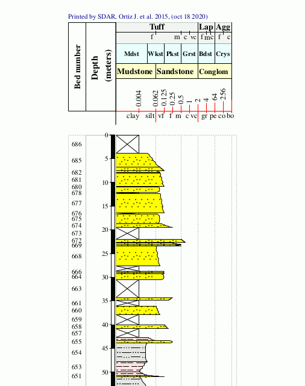
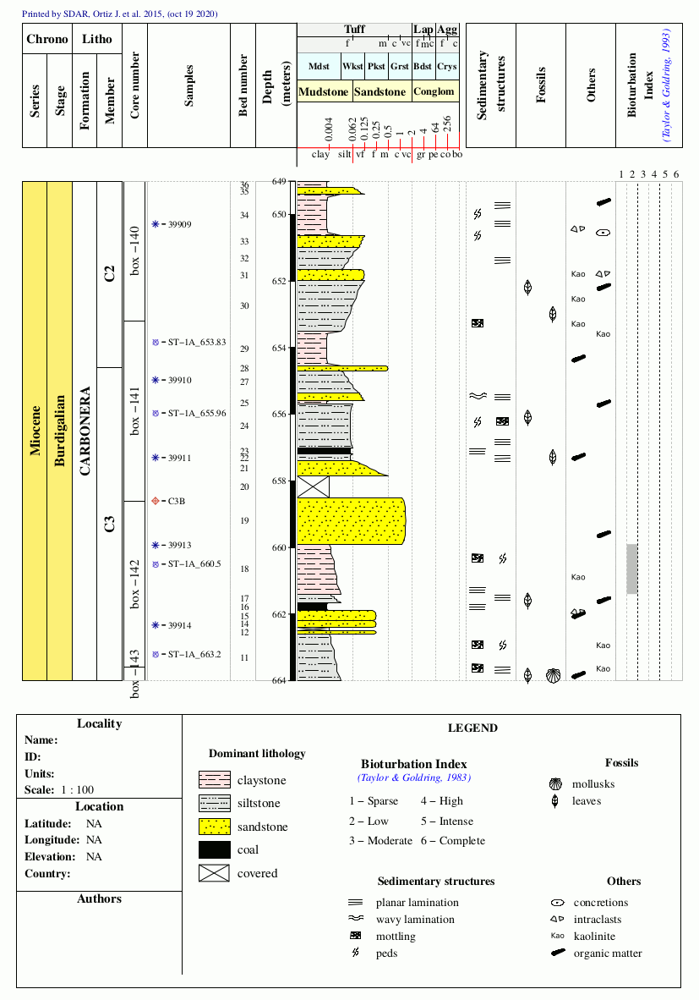

```{r, echo = FALSE, message = FALSE}
knitr::opts_chunk$set(collapse = T, comment = "#>")
options(tibble.print_min = 4L, tibble.print_max = 4L, pillar.sigfig = 5)
library(SDAR)
```

## Introduction to Stratigraphic Data Analysis (SDAR)

<center>
#### **John Ortiz <sup>1,2,3</sup>, Carlos Jaramillo <sup>1,2</sup>**
</center>

<sup>1</sup> Smithsonian Tropical Research Institute, Balboa, Ancón, Republic of Panama,
<sup>2</sup> Corporación Geológica ARES, Bogotá, Colombia.
<sup>3</sup> Servicio Geológico Colombiano, Bogotá, Colombia.


>**SDAR** is a fast and consistent tool for plotting and facilitating the analysis of stratigraphic
and sedimentological data, designed to plot detailed stratigraphic sections and to perform 
quantitative stratigraphic analyses.

### Introduction

Stratigraphic Columns (SC) are the most useful and common ways to represent the field
descriptions (e.g., grain size, the thickness of rock packages, fossil
content and lithological components) of rock sequences and well logs. 
In these representations, the width of SC vary according to the grain size 
(i.e., the wider the strata, the coarser the rocks 
(<a name=cite-miall></a><a href="#bib-miall">Miall 1990</a>; 
 <a name=cite-tucker></a><a href="#bib-tucker">Tucker 2011</a>),
and the thickness of each layer is represented at the vertical axis of the 
diagram. Typically these representations are drawn 'manually' using vector 
graphic editors (e.g., Adobe Illustrator<sup>**&#174;**</sup>, CorelDRAW<sup>**&#174;**</sup>, Inskape).
Nowadays there are various software packages which automatically plots SCs, but there
are not versatile open-source tools and it is very difficult to both store
and analyse stratigraphic information.

This document presents Stratigraphic Data Analysis in R (**SDAR**), an analytical
package designed for both plotting and facilitate the analysis of Stratigraphic
Data in R (<a name=cite-r></a><a href="#bib-r">R Core Team 2019</a>). **SDAR**, 
uses simple stratigraphic data and takes advantage
of the flexible plotting tools available in R to produce detailed SCs. 
The main benefits of **SDAR** are: 

*  used to generate accurate and complete SC plot including multiple features
   (e.g., sedimentary structures, samples, fossil content, color, lithological framework)
*  developed in a free software environment for statistical computing and graphics
*  run on a wide variety of platforms (i.e., UNIX, Windows, and MacOS)
*  both plotting and analysing functions can be executed directly on R's 
   command-line interface (CLI), consequently this feature enables users
   to integrate SDAR's functions with several other add-on packages available
   for R from [The Comprehensive R Archive Network](https://cran.r-project.org) (CRAN).

### Getting started

To install **SDAR** package from CRAN:

```{r, eval = FALSE}
install.packages("SDAR")
```
#### Workflow

The standard workflow in SDAR consists of

*  Importing data (from a SDAR template "Microsoft Excel spreadsheet", your own 
   database or a flat file)
*  Data validation
*  Plot the stratigraphic section or well log as a PDF file
*  Customising of the graphic log by adding **Interval** information 
   (e.g., sedimentary structures, fossils, bioturbation) or information collected at specific
   points (e.g., gamma ray)
*  Data analysis (e.g., summary statistics of lithologies and grain size, fossil occurrences)

*****
#### DATA: <code>saltarin_beds</code>

To explore the functionalities of SDAR, we will use the publicly available dataset of Saltarin well,
<code>saltarin_beds</code> is the example dataset available within SDAR,
this dataset gives a lithologic description for borehole Saltarin 1A, located in the Llanos Basin in
eastern Colombia (4.612 N, 70.495 W). The stratigraphic well Saltarin 1A drilled 671 meters of the
Miocene succession of the eastern Llanos basin, corresponding to the Carbonera (124.1 m; 407.1
ft), Leon (105.1 m; 344.8 ft), and Guayabo Formations (441.8 m; 1449.5 ft) (<a name=cite-bayona></a><a
href="#bib-bayona">Bayona, et al. 2008</a>). The Saltarin core was described at a scale of 1:50 for
identification of grain-size trends, sedimentary structures, clast composition, the thickness of 
lamination, bioturbation patterns, and macrofossil identification, all of which are used for 
identifying individual lithofacies and for sedimentological and stratigraphic analyses 
(<a name=cite-jaramillo></a><a href="#bib-jaramillo">Jaramillo et al., 2017</a>).

The command <code>data(saltarin_beds)</code> will load the dataset <code>saltarin_beds</code> into
the current R session. 

```{r}
library(SDAR)     # Load SDAR library
data(saltarin_beds)     # load Saltarin demo dataset
class(saltarin_beds)

# check the content and the structure of Saltarin_beds dataset

nrow(saltarin_beds)     # number of rock layers
ncol(saltarin_beds)     # number of variables recording composition and texture description of each layer
names(saltarin_beds)     # variable names of composition and texture description of each layer
```
<p>Note that <code>saltarin_beds</code> is a data frame object with 686 layers (rows), and 22 variables
(columns) storing thickness, composition and texture description of each layer, stored following the 
suggested format by SDAR (<b>to get more details about the specific types of data required by SDAR,
check <code>SDAR_data_model</code> vignette</b>).<br>
In order to draw a stratigraphic layer in SDAR,
the minimum information required for each layer is <code>bed_number</code>, thickness (i.e, it is 
defined by a <code>base</code> and a <code>top</code>), <code>rock_type</code>, <code>prim_litho</code>,
and <code>grain_size</code>. In summary, a table with the structure presented in <b>table 1</b> must be 
provided.</p>

<center>
#### Table 1: Example of beds/layers table.
> <p> This example is from a borehole core where depths are measured down from the surface,<br>
  therefore "base" is greather than "top".</p>
<table style="border-collapse:collapse; border:none; width:540px">
<tr>
<th style="border-top: double; color:white; background-color:#1D1D1D; font-style:italic; font-weight:bold; 
    padding:0.2cm; border-bottom:1px solid black; text-align:left; ">bed_number</th>
<th style="border-top: double; color:white; background-color:#1D1D1D; text-align:center; font-style:italic;
    font-weight:bold; padding:0.2cm; border-bottom:1px solid black; ">base</th>
<th style="border-top: double; color:white; background-color:#1D1D1D; text-align:center; font-style:italic;
    font-weight:bold; padding:0.2cm; border-bottom:1px solid black; ">top</th>
<th style="border-top: double; color:white; background-color:#1D1D1D; text-align:center; font-style:italic;
    font-weight:bold; padding:0.2cm; border-bottom:1px solid black; ">rock_type</th>
<th style="border-top: double; color:white; background-color:#1D1D1D; text-align:center; font-style:italic;
    font-weight:bold; padding:0.2cm; border-bottom:1px solid black; ">prim_litho</th>
<th style="border-top: double; color:white; background-color:#1D1D1D; text-align:center; font-style:italic;
    font-weight:bold; padding:0.2cm; border-bottom:1px solid black; ">grain_size</th>
</tr>
<tr>
<td style=" padding:0.2cm; vertical-align:top; text-align:center; background-color:#fdfd96; ">1</td>
<td style=" padding:0.2cm; vertical-align:top; text-align:center; background-color:#fdfd96; ">671</td>
<td style=" padding:0.2cm; vertical-align:top; text-align:center; background-color:#fdfd96; ">670.2</td>
<td style=" padding:0.2cm; vertical-align:top; text-align:center; background-color:#fdfd96; ">sedimentary</td>
<td style=" padding:0.2cm; vertical-align:top; text-align:left; background-color:#fdfd96; ">claystone</td>
<td style=" padding:0.2cm; vertical-align:top; text-align:left; background-color:#fdfd96; ">clay</td>
</tr>
<tr>
<td style=" padding:0.2cm; vertical-align:top; text-align:center; background-color:#f2f2f2; ">2</td>
<td style=" padding:0.2cm; vertical-align:top; text-align:center; background-color:#f2f2f2; ">670.2</td>
<td style=" padding:0.2cm; vertical-align:top; text-align:center; background-color:#f2f2f2; ">669.4</td>
<td style=" padding:0.2cm; vertical-align:top; text-align:center; background-color:#f2f2f2; ">covered</td>
<td style=" padding:0.2cm; vertical-align:top; text-align:left; background-color:#f2f2f2; "></td>
<td style=" padding:0.2cm; vertical-align:top; text-align:left; background-color:#f2f2f2; "></td>
</tr>
<tr>
<td style=" padding:0.2cm; vertical-align:top; text-align:center; background-color:#fdfd96; ">3</td>
<td style=" padding:0.2cm; vertical-align:top; text-align:center; background-color:#fdfd96; ">669.4</td>
<td style=" padding:0.2cm; vertical-align:top; text-align:center; background-color:#fdfd96; ">669.18</td>
<td style=" padding:0.2cm; vertical-align:top; text-align:center; background-color:#fdfd96; ">sedimentary</td>
<td style=" padding:0.2cm; vertical-align:top; text-align:left; background-color:#fdfd96; ">sandstone</td>
<td style=" padding:0.2cm; vertical-align:top; text-align:left; background-color:#fdfd96; ">medium sand</td>
</tr>
<tr>
<td style=" padding:0.2cm; vertical-align:top; text-align:center; background-color:#f2f2f2; ">4</td>
<td style=" padding:0.2cm; vertical-align:top; text-align:center; background-color:#f2f2f2; ">669.18</td>
<td style=" padding:0.2cm; vertical-align:top; text-align:center; background-color:#f2f2f2; ">667.6</td>
<td style=" padding:0.2cm; vertical-align:top; text-align:center; background-color:#f2f2f2; ">sedimentary</td>
<td style=" padding:0.2cm; vertical-align:top; text-align:left; background-color:#f2f2f2; ">limestone</td>
<td style=" padding:0.2cm; vertical-align:top; text-align:left; background-color:#f2f2f2; ">wackestone</td>
</tr>
<tr>
<td style=" padding:0.2cm; vertical-align:top; text-align:center; background-color:#fdfd96; ">5</td>
<td style=" padding:0.2cm; vertical-align:top; text-align:center; background-color:#fdfd96; ">667.6</td>
<td style=" padding:0.2cm; vertical-align:top; text-align:center; background-color:#fdfd96; ">667.2</td>
<td style=" padding:0.2cm; vertical-align:top; text-align:center; background-color:#fdfd96; ">sedimentary</td>
<td style=" padding:0.2cm; vertical-align:top; text-align:left; background-color:#fdfd96; ">conglomerate</td>
<td style=" padding:0.2cm; vertical-align:top; text-align:left; background-color:#fdfd96; ">boulder</td>
</tr>
<tr>
<td style=" padding:0.2cm; vertical-align:top; text-align:center; border-bottom: double; background-color:#f2f2f2; ">6</td>
<td style=" padding:0.2cm; vertical-align:top; text-align:center; border-bottom: double; background-color:#f2f2f2; ">667.2</td>
<td style=" padding:0.2cm; vertical-align:top; text-align:center; border-bottom: double; background-color:#f2f2f2; ">666.2</td>
<td style=" padding:0.2cm; vertical-align:top; text-align:center; border-bottom: double; background-color:#f2f2f2; ">sedimentary</td>
<td style=" padding:0.2cm; vertical-align:top; text-align:left; border-bottom: double; background-color:#f2f2f2; ">shale</td>
<td style=" padding:0.2cm; vertical-align:top; text-align:left; border-bottom: double; background-color:#f2f2f2; ">silt</td>
</tr>
</table>
</center>

<p><br></p>

```{r}
# header of the mandatory fields of "saltarin_beds" dataset to draw a graphic log using SDAR
head(saltarin_beds[,1:6])
```

><p><b>NOTE</b>: The SDAR project includes the development of a graphic user interface to connect this
R package with a database management system; for this reason the structure of the data and headers
(column names) should be followed in order to match the database structure.<br>
To improve communication between geoscientists,
some conventions, defined by sedimentologists to draw lithology patterns, and to describe grain size, color
and so on, are implemented. Details on the information required to define a layer and the sources for the
conventions implemented are provided in the vignette "SDAR data model".</p>

```{r, eval = FALSE}
vignette("SDAR_data_model")
```

*****
#### Getting your own data into R

We have provided on the [**SDAR repository**](https://repository.si.edu/10088/35917) a template of the
data format used by SDAR as a Microsoft Excel spreadsheet, ***SDAR_v0.95_beds_template.xlsx***. This is
the suggested format by SDAR to store thickness, composition and texture description of rock layers (beds).
The data for each bed should be presented as a row, with columns for each of the parameters entered
for that bed (e.g., thickness, lithology, grain size and so on). 

The simplest way to get your stratigraphic data into R for use with SDAR is to fill out the SDAR 
beds Excel template and import this file into R. There are several functions to load Excel files
into R, below are the steps to import an Excel file using the <code>readxl</code> package.

To install **readxl** package from CRAN:

```{r, eval = FALSE}
install.packages("readxl")
```

In order to import an Excel file, navigate to your working directory (for example, with <code>setwd()</code>),
or add the full path where your file is stored to the <code>read_excel</code> function.

```{r, eval = FALSE}
library (readxl)     # load the readxl package
my_beds <- read_excel("file_name.xlsx")     # on your working directory 
my_beds <- read_excel("Path where your Excel file is stored/file_name.xlsx")     # setting full path

# Notice that the separator between folders is forward slash (/), as it is on Linux and Mac systems.
# When working in Windows, you need to either use the forward slash or using double backslash (\\).
my_beds <- read_excel("C:\\Users\\john\\Desktop\\File_name.xlsx")     # full path example in windows systems
```

#### Additional external data examples

The Saltarin well example dataset available within SDAR is also accesible in Excel format, it is available
in installed files folder <code>inst/extdata</code>, to find <code>inst/extdata/SDAR_v0.95_beds_saltarin.xlsx</code>,
you need to call <code>system.file("extdata", "mydata.xlsx", package = "mypackage")</code>.

```{r}
#  Read the SDAR beds external data example (Excel file format)
library (readxl) 
fpath <- system.file("extdata", "SDAR_v0.95_beds_saltarin.xlsx", package = "SDAR")
beds_data <- read_excel(fpath)

nrow(beds_data)   # number of rock layers
names(beds_data)  # variable names of composition and texture description of each layer
```

### Data validation - the `strata` class

Validating data is all about checking whether a dataset meets all the requirements it must to fulfill,
and the <code>strata</code> function makes it easy for you to check if your stratigraphic data satisfy
the defined SDAR data model. The **SDAR** package introduces a new S4 object class called `strata` 
to store stratigraphic data. This S4 class gives a rigorous definition of a `strata` object. 
The valid object of this S4 class will meet all the requirements specified in the definition 
(e.g., the names of the columns must be called: **bed_number**, **base**, **top**, **rock_type**, 
**prim_litho**, **grain_size**, also **base** and **top** must be of a numeric type). 
The definition of this S4 class reduces errors. It recognizes the type of information that the 
object contains, and the validity of it (<a name=cite-wickham></a><a href="#bib-wickham">wickham 2014</a>).

The `strata` class provide an additional argument called `datum`, this parameter allows users to define
the horizontal reference datum. The options are **base** or **top**; `base` is the case when thickness is
measured up from the bottom of, e.g., an outcrop section; `top` is the case when depths are measured
down from the surface, e.g., boreholes and cores. The default options is `datum = "top"`

```{r}
# strata function automatically validates the inputted dataset
# and returns a stratigraphy class object.

validated_beds <- strata(saltarin_beds)

# check the class of the object generated by the strata function
class(validated_beds)
```

The previous chunk of code validated the inputted dataset `saltarin_beds` and returns a new `strata` 
class object **validated_beds**. The fact that there are no warnings or errors 
`beds data has been validated successfully` means that indeed each row (bed/layer) information in 
the input data, successfully satisfy the expectations in **SDAR data model**  (an error would occur 
for example, if we’d misspell sandstone). By default, all errors and warnings are printed out on 
the R console screen when validation rules are confronted with input data. The following example
contains an error specification **Error: Check row numbers 3, 7. values (sandtone, mudston) 
are 'prim_litho' not register in 'litho.table'.** (note that sandstone and mudstone are misspelled,
therefore the error is caught and shown in the R console). In beds/layers stratigraphic overlapping
is not allowed, if overlapping occurs `strata` function will print an error on screen and return
a dataframe object with the overlapping intervals.

In order to validate data from an outcrop / stratigraphic section, set the parameter `datum = "top"`
```{r, eval = FALSE}
# datum = "base" must be selected when stratigraphic distance above datum 
# increases upwards (toward younger levels, as a stratigraphic section).
outcrop_validated_beds <- strata(my_outcrop_beds, datum = "base")
```

### Methods within the `strata` class

In this version of **SDAR** package, the methods associated with the `strata` class are `plot`  and `summary`.
Once the stratigraphy data is loaded into R, and sucessfully validated on the `strata` class, we are able to 
plot `strata` class objects to visualise the information. The plot method provides different
outputs depending on the parameter settings. The `summary` method displays standard information about 
the `strata` class object. The `summary` function displays a synopsis of the content in the `strata`
object including the total number of layers, the thickness of the study section and the number of layers
by lithology type, and grain size. 

#### Plot method for `strata` class

The minimal information required to plot a stratigraphic column using **SDAR** is a table with the
structure presented in **table 1**. Having a defined and a validated dataset, as a `strata` class,
the plot method `plot.strata` is accessed automatically.

```{r, eval = FALSE}
# Code to generate example presented in Figure 1.
library(SDAR)     # load SDAR library
data(saltarin_beds)     # load Saltarin beds dataset
validated_beds <- strata(saltarin_beds)     # validates the Saltarin_beds dataset
plot(validated_beds)     # plot a stratigraphic log with the SDAR default options
# The default parameters are: `datum = "top"`, `data.units = "feet"`, 
# `scale = 100`, and `barscale = 2`
```

<center>


&emsp; &emsp; &emsp; &emsp; &emsp; &emsp; &emsp; **Figure 1**: Output example of the plot method for a `strata` class. The Saltarin datased was previously<br/>
&emsp; &emsp; &emsp; &emsp; &emsp; &emsp; validated into a strata class, here it is plotted using the default parameters.
</br>
</center>

<p><br></p>

#### Setting up drawing scale, and the unit of measurement

This plotting parameter (`scale`) enables users to employ different drawing scales (graphic vertical scaling).
It defines the vertical scale to draw the graphic log, from 1:1 to any desired scale (e.g., 1:50, 1:200, 1:500).
Moreover, the `data.units` parameter allows users to specifies the unit of measure of the stratigraphic 
thickness used in input data (thickness measured in field), the user defines whether the data were measured
in meters or feet, default unit ’feet’.

```{r, eval = FALSE}
# Code to generate example presented in Figure 2.
plot(validated_beds, data.units="meters", scale=300, barscale=5)
# plot Saltarin dataset at 1:300 scale in meters (meters was the measure unit in the description
# process of Saltarin well), and thickness marks and labels each 5 meters, by default the bar scale is 
# plotted at the left side of the lithology track.
```

<center>


&emsp; &emsp; &emsp; &emsp; &emsp; &emsp; &emsp; **Figure 2**: Saltarin dataset setting the parameter 
data.units = "meters", scale 1:300, and barscale = 5.
</br>
</center>

<p><br></p>

#### Drawing a specific interval for a given outcrop section or borehole log

Given that the stratigraphic information is stored in a numerical format, SDAR provides the option to draw
a specific interval for a given outcrop section or borehole log. The parameters included in plot function
that allows this functionality are: 
*   **subset.base** This argument defines the lower limit of the stratigraphic interval of interest.
*   **subset.top** Defines the upper limit of the stratigraphic interval of interest.

```{r, eval = FALSE}
# Code to generate the example presented in Figure 3.
plot(validated_beds, data.units="meters", subset.base=614, subset.top=597)
```

<center>


&emsp; &emsp; &emsp; &emsp; &emsp; &emsp; &emsp; **Figure 3**: The beds included into the stratigraphic
interval defined by `subset.base` and `subset.top` parameters [614 - 597 meters] are plotted.
</br>
</center>

<p><br></p>

#### Graded Bedding - Modifying grain size of a specific layer

Often the grain size is not a constant parameter throughout a rock layer, for that reason, in a detailed
field description geologists include the grain size variation. Usually, the grain size is described
at the bottom and at the top of the layer. Grading commonly consists of an upward decrease in grain size
(normal grading), however, certain sedimentary process result in an upward increase in grain size
(inverse grading). When grading is normal or inverse, the grain size of the base and top must be provided
in the format presented in **Table 2**.

<center>
#### Table 2: Example of beds/layers table including grading information.
> <p> In order to include and represent gradding information in SDAR, the columns <b>grading</b>,<br>
  <b>grain_size_base</b>, and <b>grain_size_top</b> must be included in beds/layers table.</p>
<table style="border-collapse:collapse; border:none; width:540px">
<tr>
<th style="border-top: double; color:white; background-color:#1D1D1D; font-style:italic; font-weight:bold; 
    padding:0.2cm; border-bottom:1px solid black; text-align:left; ">bed_number</th>
<th style="border-top: double; color:white; background-color:#1D1D1D; text-align:center; font-style:italic;
    font-weight:bold; padding:0.2cm; border-bottom:1px solid black; ">base</th>
<th style="border-top: double; color:white; background-color:#1D1D1D; text-align:center; font-style:italic;
    font-weight:bold; padding:0.2cm; border-bottom:1px solid black; ">top</th>
<th style="border-top: double; color:white; background-color:#1D1D1D; text-align:center; font-style:italic;
    font-weight:bold; padding:0.2cm; border-bottom:1px solid black; ">rock_type</th>
<th style="border-top: double; color:white; background-color:#1D1D1D; text-align:center; font-style:italic;
    font-weight:bold; padding:0.2cm; border-bottom:1px solid black; ">prim_litho</th>
<th style="border-top: double; color:white; background-color:#1D1D1D; text-align:center; font-style:italic;
    font-weight:bold; padding:0.2cm; border-bottom:1px solid black; ">grain_size</th>
<th style="border-top: double; color:white; background-color:#1D1D1D; text-align:center; font-style:italic;
    font-weight:bold; padding:0.2cm; border-bottom:1px solid black; ">grading</th>
<th style="border-top: double; color:white; background-color:#1D1D1D; text-align:center; font-style:italic;
    font-weight:bold; padding:0.2cm; border-bottom:1px solid black; ">grain_size_base</th>
<th style="border-top: double; color:white; background-color:#1D1D1D; text-align:center; font-style:italic;
    font-weight:bold; padding:0.2cm; border-bottom:1px solid black; ">grain_size_top</th>
</tr>
<tr>
<td style=" padding:0.2cm; vertical-align:top; text-align:center; background-color:#fdfd96; ">1</td>
<td style=" padding:0.2cm; vertical-align:top; text-align:center; background-color:#fdfd96; ">671</td>
<td style=" padding:0.2cm; vertical-align:top; text-align:center; background-color:#fdfd96; ">670.2</td>
<td style=" padding:0.2cm; vertical-align:top; text-align:center; background-color:#fdfd96; ">sedimentary</td>
<td style=" padding:0.2cm; vertical-align:top; text-align:left; background-color:#fdfd96; ">claystone</td>
<td style=" padding:0.2cm; vertical-align:top; text-align:left; background-color:#fdfd96; ">clay</td>
<td style=" padding:0.2cm; vertical-align:top; text-align:left; background-color:#fdfd96; "></td>
<td style=" padding:0.2cm; vertical-align:top; text-align:left; background-color:#fdfd96; "></td>
<td style=" padding:0.2cm; vertical-align:top; text-align:left; background-color:#fdfd96; "></td>
</tr>
<tr>
<td style=" padding:0.2cm; vertical-align:top; text-align:center; background-color:#f2f2f2; ">2</td>
<td style=" padding:0.2cm; vertical-align:top; text-align:center; background-color:#f2f2f2; ">670.2</td>
<td style=" padding:0.2cm; vertical-align:top; text-align:center; background-color:#f2f2f2; ">669.4</td>
<td style=" padding:0.2cm; vertical-align:top; text-align:center; background-color:#f2f2f2; ">covered</td>
<td style=" padding:0.2cm; vertical-align:top; text-align:left; background-color:#f2f2f2; "></td>
<td style=" padding:0.2cm; vertical-align:top; text-align:left; background-color:#f2f2f2; "></td>
<td style=" padding:0.2cm; vertical-align:top; text-align:left; background-color:#f2f2f2; "></td>
<td style=" padding:0.2cm; vertical-align:top; text-align:left; background-color:#f2f2f2; "></td>
<td style=" padding:0.2cm; vertical-align:top; text-align:left; background-color:#f2f2f2; "></td>
</tr>
<tr>
<td style=" padding:0.2cm; vertical-align:top; text-align:center; background-color:#fdfd96; ">3</td>
<td style=" padding:0.2cm; vertical-align:top; text-align:center; background-color:#fdfd96; ">669.4</td>
<td style=" padding:0.2cm; vertical-align:top; text-align:center; background-color:#fdfd96; ">669.18</td>
<td style=" padding:0.2cm; vertical-align:top; text-align:center; background-color:#fdfd96; ">sedimentary</td>
<td style=" padding:0.2cm; vertical-align:top; text-align:left; background-color:#fdfd96; ">sandstone</td>
<td style=" padding:0.2cm; vertical-align:top; text-align:left; background-color:#fdfd96; ">medium sand</td>
<td style=" padding:0.2cm; vertical-align:top; text-align:left; background-color:#fdfd96; ">normal</td>
<td style=" padding:0.2cm; vertical-align:top; text-align:left; background-color:#fdfd96; ">coarse sand</td>
<td style=" padding:0.2cm; vertical-align:top; text-align:left; background-color:#fdfd96; ">fine / medium sand</td>
</tr>
<tr>
<td style=" padding:0.2cm; vertical-align:top; text-align:center; background-color:#f2f2f2; ">4</td>
<td style=" padding:0.2cm; vertical-align:top; text-align:center; background-color:#f2f2f2; ">669.18</td>
<td style=" padding:0.2cm; vertical-align:top; text-align:center; background-color:#f2f2f2; ">667.6</td>
<td style=" padding:0.2cm; vertical-align:top; text-align:center; background-color:#f2f2f2; ">sedimentary</td>
<td style=" padding:0.2cm; vertical-align:top; text-align:left; background-color:#f2f2f2; ">limestone</td>
<td style=" padding:0.2cm; vertical-align:top; text-align:left; background-color:#f2f2f2; ">wackestone</td>
<td style=" padding:0.2cm; vertical-align:top; text-align:left; background-color:#f2f2f2; ">normal</td>
<td style=" padding:0.2cm; vertical-align:top; text-align:left; background-color:#f2f2f2; ">packstone</td>
<td style=" padding:0.2cm; vertical-align:top; text-align:left; background-color:#f2f2f2; ">wackestone</td>
</tr>
<tr>
<td style=" padding:0.2cm; vertical-align:top; text-align:center; background-color:#fdfd96; ">5</td>
<td style=" padding:0.2cm; vertical-align:top; text-align:center; background-color:#fdfd96; ">667.6</td>
<td style=" padding:0.2cm; vertical-align:top; text-align:center; background-color:#fdfd96; ">667.2</td>
<td style=" padding:0.2cm; vertical-align:top; text-align:center; background-color:#fdfd96; ">sedimentary</td>
<td style=" padding:0.2cm; vertical-align:top; text-align:left; background-color:#fdfd96; ">conglomerate</td>
<td style=" padding:0.2cm; vertical-align:top; text-align:left; background-color:#fdfd96; ">boulder</td>
<td style=" padding:0.2cm; vertical-align:top; text-align:left; background-color:#fdfd96; ">inverse</td>
<td style=" padding:0.2cm; vertical-align:top; text-align:left; background-color:#fdfd96; ">cobble</td>
<td style=" padding:0.2cm; vertical-align:top; text-align:left; background-color:#fdfd96; ">boulder</td>
</tr>
<tr>
<td style=" padding:0.2cm; vertical-align:top; text-align:center; border-bottom: double; background-color:#f2f2f2; ">6</td>
<td style=" padding:0.2cm; vertical-align:top; text-align:center; border-bottom: double; background-color:#f2f2f2; ">667.2</td>
<td style=" padding:0.2cm; vertical-align:top; text-align:center; border-bottom: double; background-color:#f2f2f2; ">666.2</td>
<td style=" padding:0.2cm; vertical-align:top; text-align:center; border-bottom: double; background-color:#f2f2f2; ">sedimentary</td>
<td style=" padding:0.2cm; vertical-align:top; text-align:left; border-bottom: double; background-color:#f2f2f2; ">shale</td>
<td style=" padding:0.2cm; vertical-align:top; text-align:left; border-bottom: double; background-color:#f2f2f2; ">silt</td>
<td style=" padding:0.2cm; vertical-align:top; text-align:left; border-bottom: double; background-color:#f2f2f2; "></td>
<td style=" padding:0.2cm; vertical-align:top; text-align:left; border-bottom: double; background-color:#f2f2f2; "></td>
<td style=" padding:0.2cm; vertical-align:top; text-align:left; border-bottom: double; background-color:#f2f2f2; "></td>
</tr>
</table>
</center>

<p><br></p>

### Plotting interval features

In the previous sections it was presented how SDAR represents the information associated with beds. Here, 
how SDAR integrate intervals attributes (e.g., bioturbation, sedimentary structures) is presented.

An interval is defined over a stratigraphic range; it has to be defined by a base and a top, the main requirement
to set an interval is that the recorded geological feature (e.g., sedimentary structures, 
bioturbation, unit name, fossil content) is presented throughout the defined stratigraphic range. 

In the data structure to define intervals, the user must define a stratigraphical base, top, and the recorded
feature of each interval as is presented in **Table 3**. Each row in this data array describes a stratigraphic
interval with the feature described on it **(to get more details about the specific types of data required by 
SDAR, check SDAR_data_model vignette)**. The interval features available to integrate in this SDAR version are:
*  core number
*  samples
*  visual oil stain
*  bioturbation
*  sedimentary structures
*  fossils
*  other symbols
*  lithostratigraphy
*  chronostratigraphy

<center>
##### Table 3: Examples of interval tables.
##### Bioturbation
<table style="border-collapse:collapse; border:none; width:440px">
<tr>
<th style="border-top: double; color:white; background-color:#1D1D1D; text-align:center; font-style:italic; font-weight:bold; padding:0.2cm; border-bottom:1px solid black; ">base</th>
<th style="border-top: double; color:white; background-color:#1D1D1D; text-align:center; font-style:italic; font-weight:bold; padding:0.2cm; border-bottom:1px solid black; ">top</th>
<th style="border-top: double; color:white; background-color:#1D1D1D; text-align:center; font-style:italic; font-weight:bold; padding:0.2cm; border-bottom:1px solid black; ">index</th>
<tr>
<td style=" padding:0.2cm; vertical-align:top; text-align:center; background-color:#fdfd96; ">669.4</td>
<td style=" padding:0.2cm; vertical-align:top; text-align:center; background-color:#fdfd96; ">669.2</td>
<td style=" padding:0.2cm; vertical-align:top; text-align:center; background-color:#fdfd96; ">intense</td>
</tr>
<tr>
<td style=" padding:0.2cm; vertical-align:top; text-align:center; background-color:#f2f2f2; ">668.6</td>
<td style=" padding:0.2cm; vertical-align:top; text-align:center; background-color:#f2f2f2; ">668.2</td>
<td style=" padding:0.2cm; vertical-align:top; text-align:center; background-color:#f2f2f2; ">moderate</td>
</tr>
<tr>
<td style=" padding:0.2cm; vertical-align:top; text-align:center; background-color:#fdfd96; ">665.2</td>
<td style=" padding:0.2cm; vertical-align:top; text-align:center; background-color:#fdfd96; ">665.0</td>
<td style=" padding:0.2cm; vertical-align:top; text-align:center; background-color:#fdfd96; ">moderate</td>
</tr>
<tr>
<td style=" padding:0.2cm; vertical-align:top; text-align:center; background-color:#f2f2f2; ">661.4</td>
<td style=" padding:0.2cm; vertical-align:top; text-align:center; background-color:#f2f2f2; ">659.9</td>
<td style=" padding:0.2cm; vertical-align:top; text-align:center; background-color:#f2f2f2; ">low</td>
</tr>
<tr>
<td style=" padding:0.2cm; vertical-align:top; text-align:center; border-bottom: double; background-color:#fdfd96; ">637.5</td>
<td style=" padding:0.2cm; vertical-align:top; text-align:center; border-bottom: double; background-color:#fdfd96; ">637.0</td>
<td style=" padding:0.2cm; vertical-align:top; text-align:center; border-bottom: double; background-color:#fdfd96; ">low</td>
</tr>
</table>
##### Sedimentary structures
<table style="border-collapse:collapse; border:none; width:440px">
<tr>
<th style="border-top: double; color:white; background-color:#1D1D1D; text-align:center; font-style:italic; font-weight:bold; padding:0.2cm; border-bottom:1px solid black; ">base</th>
<th style="border-top: double; color:white; background-color:#1D1D1D; text-align:center; font-style:italic; font-weight:bold; padding:0.2cm; border-bottom:1px solid black; ">top</th>
<th style="border-top: double; color:white; background-color:#1D1D1D; text-align:center; font-style:italic; font-weight:bold; padding:0.2cm; border-bottom:1px solid black; ">sed_structure</th>
<tr>
<td style=" padding:0.2cm; vertical-align:top; text-align:center; background-color:#fdfd96; ">671</td>
<td style=" padding:0.2cm; vertical-align:top; text-align:center; background-color:#fdfd96; ">670.2</td>
<td style=" padding:0.2cm; vertical-align:top; text-align:center; background-color:#fdfd96; ">cross bedding</td>
</tr>
<tr>
<td style=" padding:0.2cm; vertical-align:top; text-align:center; background-color:#f2f2f2; ">671.5</td>
<td style=" padding:0.2cm; vertical-align:top; text-align:center; background-color:#f2f2f2; ">671.5</td>
<td style=" padding:0.2cm; vertical-align:top; text-align:center; background-color:#f2f2f2; ">climbing ripples</td>
</tr>
<tr>
<td style=" padding:0.2cm; vertical-align:top; text-align:center; background-color:#fdfd96; ">669.4</td>
<td style=" padding:0.2cm; vertical-align:top; text-align:center; background-color:#fdfd96; ">669.18</td>
<td style=" padding:0.2cm; vertical-align:top; text-align:center; background-color:#fdfd96; ">lenticular lamination</td>
</tr>
<tr>
<td style=" padding:0.2cm; vertical-align:top; text-align:center; background-color:#f2f2f2; ">668.2</td>
<td style=" padding:0.2cm; vertical-align:top; text-align:center; background-color:#f2f2f2; ">667.6</td>
<td style=" padding:0.2cm; vertical-align:top; text-align:center; background-color:#f2f2f2; ">normal grading</td>
</tr>
<tr>
<td style=" padding:0.2cm; vertical-align:top; text-align:center; border-bottom: double; background-color:#fdfd96; ">667.2</td>
<td style=" padding:0.2cm; vertical-align:top; text-align:center; border-bottom: double; background-color:#fdfd96; ">666.2</td>
<td style=" padding:0.2cm; vertical-align:top; text-align:center; border-bottom: double; background-color:#fdfd96; ">wavy lamination</td>
</tr>
</table>
</center>

<p><br></p>

We have provided on the [**SDAR repository**](https://repository.si.edu/10088/35917) a template of the
data format used by SDAR as a Microsoft Excel spreadsheet, ***SDAR_v0.95_intervals_template.xlsx***. This is
the suggested format by SDAR to store interval information (e.g., bioturbation, sedimentary structures, and so on).

#### Import your own intervals data into R

In order to import a sheet from an Excel file, navigate to your working directory (for example, with <code>setwd()</code>),
or add the full path where your file is stored to the <code>read_excel</code> function, and specify the sheet to read
with a number or name (the name of a sheet) or (the position of the sheet).

```{r, eval = FALSE}
# Specify sheet by its name
my_int_data <- read_excel("file_name.xlsx", sheet= "data")     # on your working directory 
my_int_data <- read_excel("Path where your Excel file is stored/file_name.xlsx", sheet= "data")  # full path

# Specify sheet by its index
my_int_data <- read_excel("file_name.xlsx", sheet= 1)

# Notice that the separator between folders is forward slash (/), as it is on Linux and Mac systems.
# When working in Windows, you need to either use the forward slash or using double backslash (\\).
# full path example in windows systems
my_int_data <- read_excel("C:\\Users\\john\\Desktop\\File_name.xlsx", sheet= "data")     
```

The **Saltarin intervals dataset** is available in Excel format, it is available
in installed files folder <code>inst/extdata</code>, to find <code>inst/extdata/SDAR_v0.95_intervals_saltarin.xlsx</code>,
you need to call <br>
<code>system.file("extdata", "mydata.xlsx", package = "mypackage")</code>.

```{r}
#  Read the bioturbation external data example (Saltarin intervals Excel file format)
fpath <- system.file("extdata", "SDAR_v0.95_intervals_saltarin.xlsx", package = "SDAR")
bioturbation_data <- read_excel(fpath, sheet = "bioturbation")     # import bioturbation sheet

nrow(bioturbation_data)   # number of bioturbated intervals
bioturbation_data  # header of Saltarin bioturbation dataset
```

Import Saltarin intervals dataset

```{r}
# import core_number data
core_number_data <- read_excel(fpath, sheet = "core_number")
# import samples data
samples_data <- read_excel(fpath, sheet = "samples")
# import sedimentary structures data
sed_structures_data <- read_excel(fpath, sheet = "sed_structures")
# import fossils data
fossils_data <- read_excel(fpath, sheet = "fossils")

# import other symbols data
other_symbols_data <- read_excel(fpath, sheet = "other_symbols")
# import lithostratigraphy data
litho_data <- read_excel(fpath, sheet = "lithostra")
# import chronostratigraphy data
crono_data <- read_excel(fpath, sheet = "chronostra")
```

#### Display interval features

Plot setting parameters allows users to integrate features to the graphic log (e.g. sedimentary
structure, fossil content, unit name). These elements will be plotted on the right or left side of
the lithological column. Each one of these additional features will be displayed as symbols,
graphic bar, or points at the right or left side of the lithological column. **Figure 4** presents the way that
SDAR represents the interval attributes.

```{r, eval = FALSE}
# Code to generate example presented in Figure 4.
plot(validated_beds, data.units="meters",  
    subset.base=664, subset.top=649, 
    bioturbation=bioturbation_data,
    fossils=fossils_data, 
    sed.structures=sed_structures_data,
    other.sym=other_symbols_data, 
    samples=samples_data, 
    ncore=core_number_data, 
    lithostrat=litho_data, 
    chronostrat=crono_data, 
    symbols.size=0.8)
# For the performance of this example only a subset of the data is plotted. In order to plot
# the complete Saltarin Well dataset, suppress subset.base=664, and subset.top=649" parameters
```

<center>


&emsp; &emsp; &emsp; &emsp; &emsp; **Figure 4**: Graphic log of Saltarin well for [664 - 649 meters] interval, adding symbol features<br/>
&emsp; &emsp; &emsp; &emsp; &emsp; representation (e.g, sedimentary structures, fossil content, samples), bioturbation,<br/>
&emsp; &emsp; &emsp; &emsp; &emsp; and lithostratigraphic and chonostratigraphic framework.
</br>
</center>

<p><br></p>

### SDAR output

Figures 1-4 present examples of graphic logs generated automatically using **SDAR** packages after the stratigraphic
information has been correctly loaded and validated into R. Graphic log generated by **SDAR** is exported as PDF files
(completely editable with any vector drawing application). It will present on a single page, and the paper size will
automatically be updated by changes in the vertical scale, or when different sets of attributes are plotted on the
right or left side of the lithological column (**check the working directory for the PDF output file**).

>If you see problems with the PDF output, remember that the problem is much more likely to be in your viewer
than in R. Try another viewer if possible, browsers as Mozilla Firefox and Google Chrome provide an excellent
rendering engine for PDF files.

### Summary method for `strata` class data

In this section, the functionality of the `summary` method is presented. When `summary` function
is executed with a `strata` class object, the results are printed in the R console. The `summary` function displays a synopsis of the content in the `strata` object. It includes the total number of layers, the thickness of the SC, the thickness of covered intervals, thickness percent and the number of layers by lithology type, into the study SC. The results of running `summary` function with the example dataset are printed below.

```{r}
summary(validated_beds)
summary(validated_beds, grain.size=TRUE)
```

#### Acknowledgments

>This project has been sponsored by Carlos Jaramillo (Smithsonian Tropical Research Institute), 
financial support of this research was provided by COLCIENCIAS (partly funding the master studies of the
main author) fundación para la Investigación de la Ciencia y la Tecnológia del Banco de la República,
(Colombia), Corporación Geológica ARES (Colombia), and the Smithsonian Tropical Research Institute, 
the Anders Foundation, 1923 Fund and Gregory D. and Jennifer Walston Johnson.

>The Saltarin 1A well dataset for this analysis, was provided by Alejandro Mora of **HOCOL S.A.**

### Bibliography

* <a name=bib-bayona></a><a href="#cite-bayona">Bayona, G.</a>, Valencia, A., Mora, A., Rueda, M.,
  Ortiz, J., Montenegro, O. 2008. *Estratigrafia y procedencia de las rocas del Mioceno en la parte distal
  de la cuenca antepais de los Llanos de Colombia.* Geologia Colombiana, *33*, 23-46.

* <a name=bib-jaramillo></a><a href="#cite-jaramillo">Jaramillo, C.</a>, Romero, I., D'Apolito, C., Bayona, G., 
  Duarte, E., Louwye, S., Escobar, J., Luque, J., Carrillo-Briceno, J., Zapata, V., Mora, A., 
  Schouten, S., Zavada, M., Harrington, G., Ortiz, J., and Wesselingh, F., 2017, *Miocene Flooding Events of Western Amazonia*:
  Science Advances, v. 3, p. e1601693

* <a name=bib-miall></a><a href="#cite-miall">Miall, A. D. (1990)</a>. *Principles of Sedimentary Basin Analysis*. Springer-Verlag.

* <a name=bib-r></a><a href="#cite-r">R Core Team (2014)</a>. R: *A Language and Environment for Statistical Computing*.
R Foundation for Statistical Computing, Vienna, Austria.

* <a name=bib-tucker></a><a href="#cite-tucker">Tucker, M. E. (2011)</a>. *Sedimentary Rocks in the Field: 
  A Practical Guide. Geological Field Guide*. Wiley.

* <a name=bib-wickham></a><a href="#cite-wickham">Wickham, H. (2014)</a>. *Advanced R (Chapman & Hall/CRC The R Series)*.
  hapman and Hall/CRC, 1 edition.
